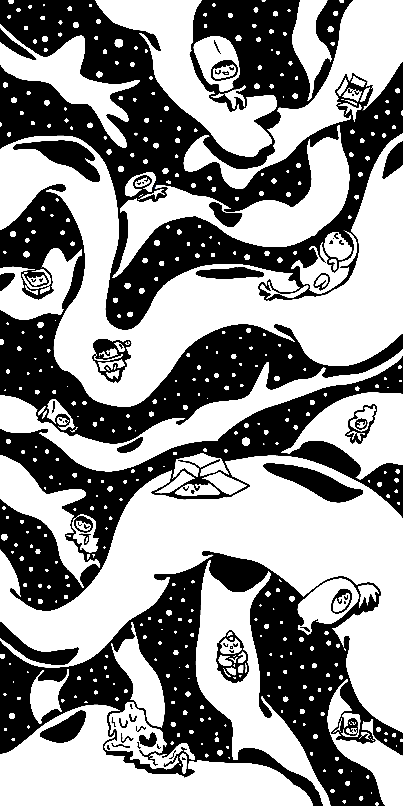

# Classy Trash Monster: An Educational Game for Teaching Machine Learning to Non-major Students


## ACM Digital Library
https://dl.acm.org/doi/10.1145/3491101.3516487
## Pre-recorded Video
https://www.youtube.com/watch?v=CEftATB-pK4
## Phone Wallpaper
  

Artwork by Joonhyung Bae

Shield: [![CC BY-NC-ND 4.0][cc-by-nc-nd-shield]][cc-by-nc-nd]

This work is licensed under a
[Creative Commons Attribution Non Commercial No Derivatives 4.0 International][cc-by-nc-nd].

[![CC BY-NC-ND 4.0][cc-by-nc-nd-image]][cc-by-nc-nd]

[cc-by-nc-nd]: http://creativecommons.org/licenses/by-nc-nd/4.0/
[cc-by-nc-nd-image]: https://licensebuttons.net/l/by-nc-nd/4.0/88x31.png
[cc-by-nc-nd-shield]: https://img.shields.io/badge/License-CC%20BY--NC--ND%204.0-lightgrey.svg

## Citation

```bibtex
@inproceedings{10.1145/3491101.3516487,
author = {Bae, Joonhyung and Eum, Karam and Kwon, Haram and Lee, Seolhee and Nam, Juhan and Doh, Young Yim},
title = {Classy Trash Monster: An Educational Game for Teaching Machine Learning to Non-Major Students},
year = {2022},
isbn = {9781450391566},
publisher = {Association for Computing Machinery},
address = {New York, NY, USA},
url = {https://doi.org/10.1145/3491101.3516487},
doi = {10.1145/3491101.3516487},
abstract = { As machine learning (ML) became more relevant to our lives, ML education for college students without technical background arose important. However, not many educational games designed to suit challenges they experience exist. We introduce an educational game Classy Trash Monster (CTM), designed to better educate ML and data dependency to non-major students who learn ML for the first time. The player can easily learn to train a classification model and solve tasks by engaging in simple game activities designed according to an ML pipeline. Simple controls, positive rewards, and clear audiovisual feedback makes game easy to play even for novice players. The playtest result showed that players were able to learn basic ML concepts and how data can impact model results, and that the game made ML feel less difficult and more relevant. However, proper debriefing session seems crucial to prevent misinterpretations that may occur in the learning process.},
booktitle = {CHI Conference on Human Factors in Computing Systems Extended Abstracts},
articleno = {479},
numpages = {7},
keywords = {Game Design, Machine Learning Education, Educational Games},
location = {New Orleans, LA, USA},
series = {CHI EA '22}
}
```
